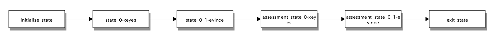

Tools
===============

``fsmt`` already comes with a few handy tools. In the following, we will list 
and explain all of them. The installation prefix of the tool depends on the prefix you set 
during installation of ``fsmt``. In this case, we will assume ``/usr/local``, 
so the tools are installed in ``/usr/local/bin``. The acronym "rx" stands for 
Ros eXample component, "ex" for Example eXecution component.

* **fsmt_exchild** This component only spawns child processes. It takes one 
  argument: number of child processes to spawn. 
  After execution, you should see ``fsmt`` killing 6 children in console the 
  output::

    fsmt_exchild 6

* **fsmt_exout** This component just writes output to the console, you might 
  use it to test your ``stdout`` criteria. You will find ``FINDME``, while 
  ``DONOTFINDME`` will not be found. It takes one argument, defining the 
  runtime duration of the component in seconds. If none is given, it will run 
  forever (or until ``fsmt`` closes it), e.g.::

    fsmt_exout 10

* **fsmt_exsilent** This component runs silently for a given amount of time 
  (in seconds). If no argument given, it runs forever (or until ``fsmt`` 
  (closes it) ::

    fsmt_exsilent

* **fsmt_exouttimed** Basically the same as **fsmt_exout**, but you can decide 
  when it should start delivering output. Additionally, you can set the run 
  duration. The first argument defines the runtime in seconds, the second 
  argument defines the time in seconds after which the component should start 
  its output::

    fsmt_exouttimed 10 2

* **fsmt_exlockouttimed** This component holds the same functionality as 
  **fsmt_exouttimed** and adds the use of a lockfile, which exists during the 
  component runtime. In the regular mode, the lockfile is removed at the end. 
  However, if you are using endless mode, the lockfile will not be removed. As 
  this component is mainly designed for testing purposes, it removes previously 
  existing lockfiles on startup and creates its own to avoid collisions and 
  unittest breaks. The additional last argument (optional) is the path to the 
  lockfile which should be used, if non is given, ``/tmp/.lockfile_$USERNAME`` 
  is used::
  
    fsmt_exlockouttimed 10 2 /path/of/lockfile/to/use/.lockfile_name    

Visualisation
-----------------

In order to visualise started components and timings, or to remotely observe 
the test, you need to start the fsmt web socket server (in a separate console)::

    fsmt_wsserver

As soon as the server is started, you may open a web browser and open 
``tools/fsmvis.html``. Now, start your test and you will see what is going on! 
Timings, indicated using the "@" sign are in seconds

.. note:: There 
	is no websocket protocol standard at the moment. We implemented Version 13 
	which works well with chromium Version 28.0.1500.71. In case you don't see any 
	output (or null) please try another browser. We will work on this issue.

Visualisation with Block Diag
------------------------------

If you need another visualisation of the steps, which are reached within 
``fsmt``, we provide you with the raw syntax of python-blockdiag.
You can install blockdiag via pip or, on ubuntu, via::

    $ sudo apt-get install python-blockdiag
    or
    $ pip install blockdiag

When your ``fsmt`` test is finished, you can find the following content in a 
separated log file. For instance::

    blockdiag {
        initialise_state -> state_0-xeyes -> state_0_1-evince -> assessment_state_0-xeyes -> assessment_state_0_1-evince -> exit_state;
    }

Now you just need to execute::

    $ blockdiag /path/to/block.diag

The result will look somewhat similar to this:

State Machine execution result in xUnit
---------------------------------------

If you want to include the results of the execution of a FSMT run in your **CI** 
system/testing environment, you can simply use the provided ``xUnit`` feature. 
``fsmt`` is therefore creating a separated ``XML`` file in the ``data`` log 
folder, which is called::

    state_component_run_test.xml

The result of an erroneous run could for example look like this::

    $ cat /tmp/nkoester/fsmt/01-09_160010/data/state_component_run_test.xml 

    <?xml version="1.0" ?>
    <testsuite failures="0" name="FSMT run on /tmp/abc.scxml" tests="3">
	    <testcase name="roscore"/>
	    <testcase name="morse">
		    <failure>57The defined component morse is faulty. The  path/command does not exist: /opt/fsmt-experiments/bin//morse -- The current working directory is: /home/nkoester/workspace</failure>
	    </testcase>
	    <testcase name="ERROR">
		    <failure>criteria</failure>
	    </testcase>
    </testsuite>

Verification of execution order, timing and general functionality 
-------------------------------------------------------------------------

If you want to verify the correctness of your state machine in terms of 
execution order, component start/end/duration timing, and general long-term
stability/functionality, you may use the component::  

	$ fsmt_validation

For a test, one can use any ``SCXML`` by giving it as an argument. On default, 50 
runs are done to test the ``SCMXL``. 

A typical call will look like this::

	
	$ fsmt_validation /tmp/stdout_example.scxml -r 5
	
	
	Writing verification log files to /tmp/nkoester/fsmt_validation/03-18_171714
	
	
	Running and observing FSMT (run 1 of 5)
	  L__ Finished - FSMT ran for 10.569s
	Running and observing FSMT (run 2 of 5)
	  L__ Finished - FSMT ran for 10.583s
	Running and observing FSMT (run 3 of 5)
	  L__ Finished - FSMT ran for 10.577s
	Running and observing FSMT (run 4 of 5)
	  L__ Finished - FSMT ran for 10.537s
	Running and observing FSMT (run 5 of 5)
	  L__ Finished - FSMT ran for 10.571s

.. note:: All output of the called ``fsmt`` instance is hidden! 
	So make sure your ``SCXML`` is actually working before using the functionality 
	tester. However, the output/logging files of **each** ``fsmt`` run are also 
	written to the logging directory as described below.

The results of the ``fsmt_validation`` component are by default written 
to :: 

	 /tmp/$USER/fsmt_validation/$MM-DD_HHMMSS

The usual structure of the logging folder is::

	$ /tmp/nkoester/tree -L 4                                                                                                                                       
	.
	└── [4.0K]  fsmt_validation
	    └── [4.0K]  03-18_171714
	(4)     ├── [4.0K]  fsmt_runs
	        │   ├── [4.0K]  03-18_171715
	        │   ├── [ 14K]  03-18_171715.zip
	        │   ├── [4.0K]  03-18_171725
	        │   ├── [ 14K]  03-18_171725.zip
	        │   ├── [...]
	(1)     ├── [1.9K]  functionality_verification_result.csv
	(2)     ├── [1.3K]  functionality_verification_process_order.csv
	(3)     └── [ 673]  functionality_verification_result_intervalls.csv

While (1) holds all information in one file, (2) only lists the order of 
execution of components within each ``fsmtest`` run, and (3) lists the time before, 
between and after of components (as well as their durations). Lastly, the 
``fsmt_runs`` folder (4) contains the logging files of each ``fsmtest`` run for your 
convenience.
