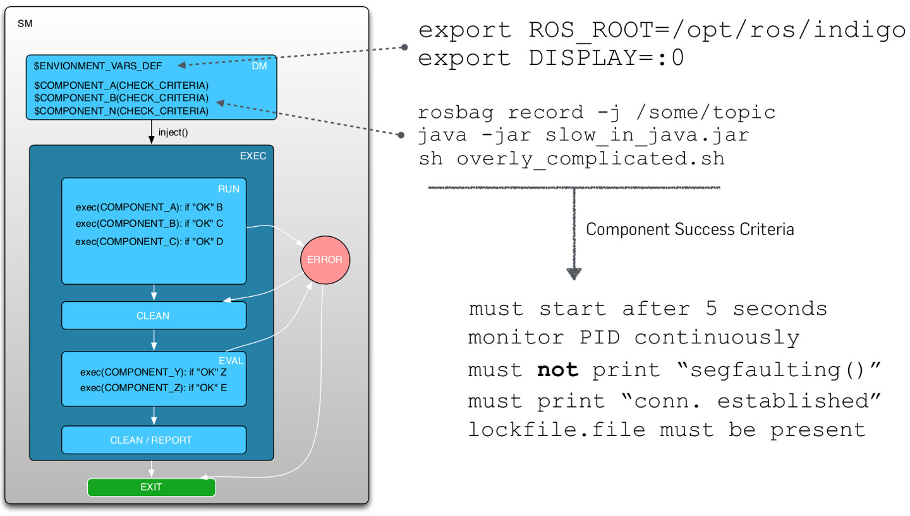
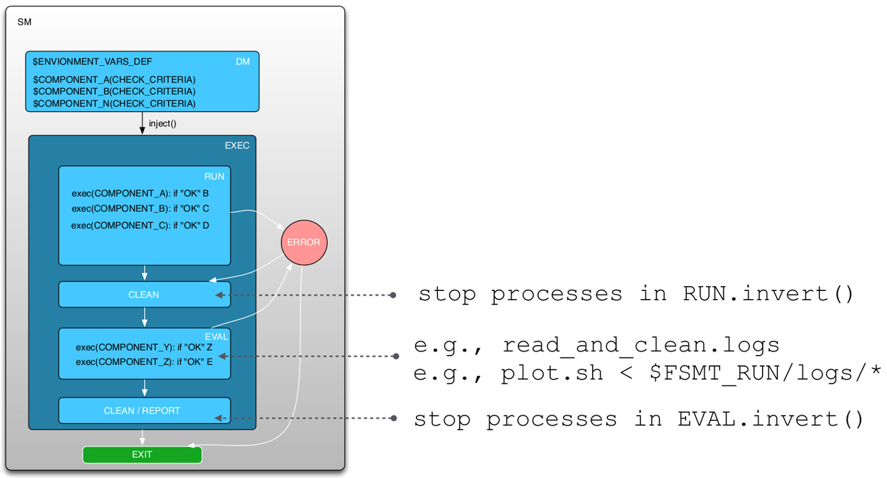
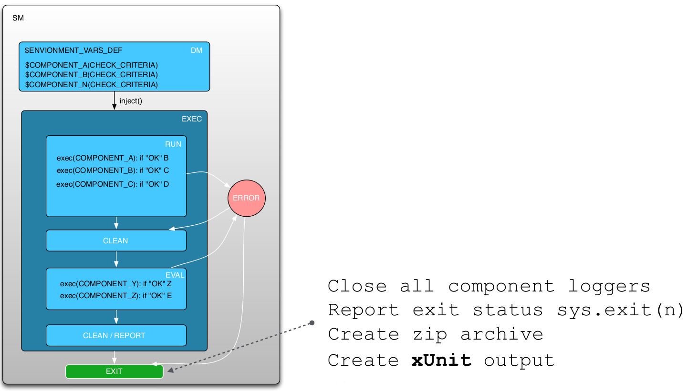

What is Finite State Machine Based Testing?
===========================================

Introduction
------------

Often, high-level (functional) tests are carried out manually, implementing a tailored solution, e.g, via shell scripts
or launch files, for a specific system setup. Besides the effort of manual execution and supervision, current tests mostly
do not take timing and orchestration, i.e., required process start-up sequence, into account. Furthermore, successful execution
of components is not verified, which might lead to subsequent errors during the execution chain. Most importantly, all
this knowledge about the test and its environment is implicit, often hidden in the actual implementation of the tailored
test suite.

To overcome these issues, this contribution introduces **a generic and configurable state-machine based process** to automate:

   * a) Environment setup
   * b) System bootstrapping
   * c) System tests
   * d) Result assessment
   * e) Exit and clean-up strategy
   
We have chosen a hierarchical state-based approach in order to inherit a well structured automaton, which enables us to
invoke the steps mentioned above, in the desired order, and to explicitly model required test steps. Furthermore, the
state-chart model enables us to invoke states in parallel, or sequentially, which also makes orchestration, e.g.,
start-up of system components, feasible and most importantly controllable. Last but not least, errors during the
execution will prematurely end the state-machine to prevent subsequent errors.

Concept
-------

Further Information, Talks, and Paper
-------------------------------------

You can find additional information about FSMT here:

 * `General System Testing Concept and CITK Tool Chain <http://www.slideshare.net/f1ier/bosch-2015testing>`_
 * `The Cognitive Interaction Toolkit – Improving Reproducibility of Robotic Systems Experiments <http://pub.uni-bielefeld.de/publication/2685091>`_
 * `Towards Automated Execution and Evaluation of Simulated Prototype HRI Experiments <http://pub.uni-bielefeld.de/publication/2645922>`_